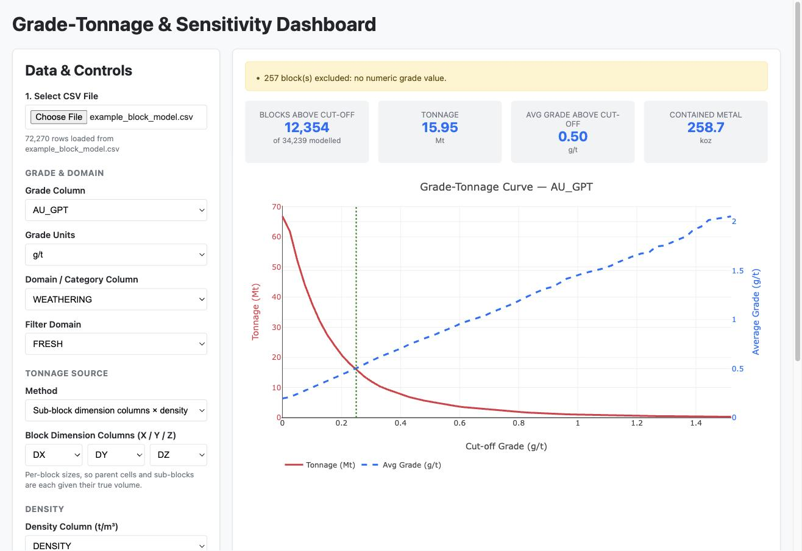

# Grade-Tonnage Dashboard

A single-file browser tool that turns a mining block model CSV into an interactive
grade-tonnage curve, with domain filtering and density-based tonnage calculation.

No install, no server, no data upload — open the HTML file, pick your CSV, and the model is
read and charted entirely in your own browser. Nothing ever leaves your machine.

## Quick start

1. Download `dashboard.html` ([direct link](../../raw/main/dashboard.html) — right-click, Save Link As)
2. Double-click it to open in your browser
3. Click **Select CSV File** and choose your block model

Try it with `example_block_model.csv` in this repo first. It's a 72,270-block synthetic
porphyry deposit and should read **136.20 Mt @ 0.197 g/t Au = 862.5 koz** at a zero cut-off.

> Requires an internet connection on first load — the charting library is fetched from a CDN.
> See [Known limitations](#known-limitations).

## What your CSV needs

Only two things are strictly required: **a grade column**, and **some way to work out tonnage**.
Everything else is optional and auto-detected where possible.

| Column | Required | Notes |
|---|---|---|
| Grade | Yes | Any numeric column — `AU_GPT`, `CU_PCT`, `NI`, … Pick the units in the sidebar. |
| Value / NSR | — | A `$/t` column — `NSR`, `VALUE26`, `PLAN26`, `STRAT26` — can be used as the grade, giving a value-tonnage curve. The price-deck year suffix is understood. |
| Tonnage source | Yes | One of: per-block dimension columns, a fixed cell size, a volume column, or a mass column. |
| `X`, `Y`, `Z` | No | Used to infer the parent cell size on regular models. |
| `DX`, `DY`, `DZ` | No | Per-block dimensions. Auto-detected; also matches `XINC`/`XSIZE`/`XLENGTH`. |
| Density | No | Auto-detected from names like `DENSITY`, `SG`, `BD`. Falls back to a default you set. |
| Domain / category | No | Any text or coded column — rock type, weathering, resource class. Used for filtering. |

Column headers are matched case-insensitively. Blocks with a blank grade, or whose tonnage
can't be resolved, are **excluded and reported** in a banner — never silently counted as zero.

## Tonnage and density

Tonnage is the part worth understanding, because it's where a model most easily produces a
confident wrong answer.

**Four ways to get tonnage**, chosen under *Tonnage Source*:

- **Sub-block dimension columns × density** — per-block `DX/DY/DZ`, so parent cells and
  sub-blocks each get their true volume. Auto-selected when those columns exist.
- **Fixed block size × density** — one parent cell size for the whole model. The size is
  inferred from coordinate spacing on regular models.
- **Volume column × density**
- **Mass column** — tonnage already computed upstream; density is ignored.

**Density is resolved in this order**, first match wins:

1. A density column, where that block has a value
2. A per-domain override (a table appears when you pick a domain column)
3. The global default (2.70 t/m³ out of the box)

This means you can set sensible densities per lithology or weathering zone, and still let a
populated density column take precedence block by block.

> **Sub-blocked models:** if coordinate spacing is uneven, the tool will *not* guess a parent
> cell size. The most common spacing in a sub-blocked model is the smallest *sub-block*, and
> using it as the parent cell understates tonnage dramatically — on the test model, by about
> 65×. It leaves the field blank and asks you to supply the parent size, or to use dimension
> columns instead.

Volumes assume coordinates in **metres** and density in **t/m³**.

## Reading the output

The four cards are all reported **above the current cut-off**, except the block count, which
also shows the total modelled. Contained metal is unit-aware: g/t reports troy ounces
(koz/Moz), while % and ppm report tonnes of metal.

Picking **$/t (net value / NSR)** as the grade unit switches the cut-off variable to dollars:
the curve, the average and the cards read as value per tonne, and *contained metal* becomes
the total dollar value above the cut-off. In imperial the same column is read as $/ton, in
step with the tonnage.

**Chart axes** can be pinned with the min/max boxes under *Chart Axes*. Leave an end blank and
it scales to the data. These only change the view — nothing about the curve or the cards
depends on them. Changing the grade column or its units clears the cut-off and average-grade
bounds, since they were typed in the old variable's units; the tonnage bounds stay put.

The cut-off slider runs from zero to the 99th percentile of grade, so a single freak
high-grade block can't stretch the axis. Dragging it is instant regardless of model size —
the curve is precomputed, so the slider only moves a marker and updates four numbers.

## Performance

Measured in Chrome on a MacBook:

| Blocks | Load → first chart | Memory | Cut-off slider |
|---|---|---|---|
| 72k | 0.3 s | ~40 MB | instant |
| 2M | 5 s | 675 MB | instant |
| 5M | 14 s | 2.0 GB | instant |

**~5 million blocks is the practical ceiling.** Beyond that you risk the browser tab running
out of memory. If you routinely work above that, filter or composite the model before export.

## Known limitations

- **Needs internet on first load.** PapaParse and Plotly come from a CDN, so the file is not
  truly self-contained. On a locked-down network or offline at site, the page will load but
  the chart won't render. Inlining the libraries would fix this.
- **No partial-block / percent-in-model factor.** Blocks are treated as wholly in or out.
- **Single variable at a time.** No metal-equivalent or multi-element curves computed in the
  app — though a `$/t` NSR column from the block model can be charted directly, which is how
  polymetallic cut-offs are usually expressed.
- Grade and tonnage columns aren't checked for being the same column.

## Contributing

Everything lives in `dashboard.html` — markup, styles and logic in one file, no build step.
Edit it and reload the browser.

If you change anything in the calculation path, check it against `example_block_model.csv`
and its published totals above, and be aware of the traps documented in
[CLAUDE.md](CLAUDE.md) — several past bugs produced plausible-looking wrong numbers rather
than errors.
